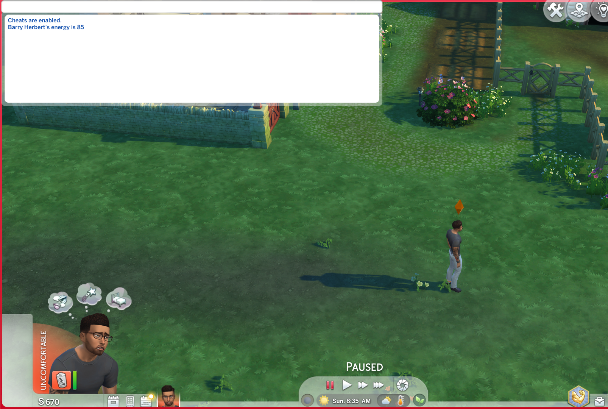

# sims4Project
the intention for this mod is to force start build and buy cheats

I have added a hellow function for testing to see if I connected to the cheat console 

so far only that is functional with the mode the file name for my creator name is din0saursN5pace that should be in front of all my scripts except the mts clown one I was looking at that code for reference.

#### update 11/22/23

 * I decided to change the scoop of the project to make a command that I could follow along so I made a mod that refills all other motives and drains 
the sleep motive for more controlled sleep schedules for all the sims in a household

 * I also made a custom motherloade cheat that adds a certain amount of money you specify.

 * that was all I managed to figure out with this code editor.

## to run

 * first you need to have the sims 4 downloaded in you computer 

 * then you need to run the compile.py script to compile the code into a .ts4script 

 * then in you mods folder the path should be (documents/ea games/the sims 4/ mods) if you downloaded it from ea, place the script in the folder

## Proof of life 

__________
***Warning***
* you should not ave any sub folders for the game does not dig into the mods folder subfolder for scripts so they should be surface level 